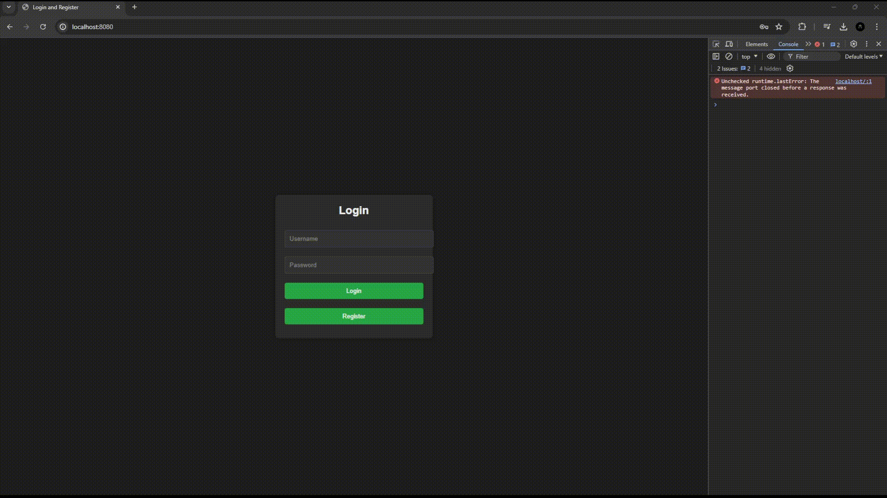

---

# Webapp

A simple web application built on top of boost beast. 

## Features

- User login and registration
- Password change
- Server status dashboard (CPU usage, requests, etc.)
- Timed session management
- 
## Files

- `index.html`: Frontend HTML and CSS
- `main.cpp`: Backend server logic

## Getting Started

1. Clone the repository.
2. Compile `main.cpp`:
   ```sh
   g++ -o main main.cpp -lpthread -std=c++17
   ```
3. Run the server:
   ```sh
   ./main 0.0.0.0 8080 . 1
   ```
4. Open `localhost:8080/` in your browser.

## API Endpoints

- `/login`: User login
- `/register`: User registration
- `/logout`: User logout
- `/status`: Get server status
- `/password`: Change password
- `/external`: Execute external requests
- `/validate-session`: Validate sessions

## Dependencies

- g++
- Boost 1.85.0
- Web browser

## Usage

- Navigate to the login page.
- Register a new account or log in with existing credentials.
- Access the dashboard to view server status or change your password.

---

## Screenshots


